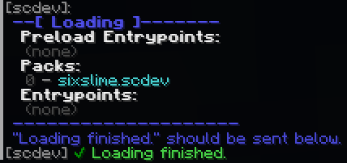
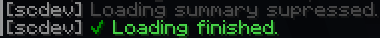
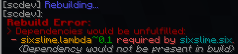
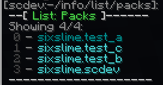
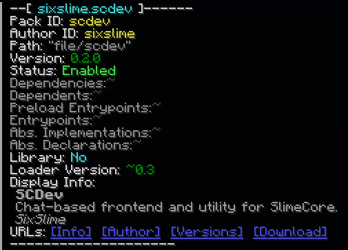

<a href="https://github.com/sixslimemc/slimecore"></a>

# SCDev | `scdev`

**ID:** `sixslime.scdev`

> Chat-based frontend and utility for SlimeCore.

## Description

SCDev is simple and accessible frontend for [SlimeCore](https://github.com/sixslimemc/slimecore) that uses chat messages and commands for interaction.

## Dependencies

None.

# Usage

- [Setup](#setup)
- [Load Summaries](#load-summaries)
- [Rebuild Messages](#rebuild-messages)
- [Explicit Rebuilding](#explicit-rebuilding)
- [Info Functions](#info-functions)

## Setup

Once SCDev is installed, add the tag `scdev.listener` to yourself.

```mcfunction
tag add @s scdev.listener
```

To confirm successful setup, run `/reload`--you should recieve a [load summary](#load-summaries) in chat. 

If you have the `scdev.listener` tag but do not recieve a load summary on `/reload`, see [this section in the SlimeCore docs](https://github.com/sixslimemc/slimecore_docs/blob/main/admin_guide/troubleshooting.md#frontend-not-loading).

SCDev will only send chat notifications to players with the `scdev.listener` tag. Many chat messages sent by SCDev contain click actions and hoverable elements; note that click actions will only work if the player has operator privilages.

## Load Summaries

Upon every world reload, a **load summary** is sent.

Load summaries include:
- **Preload Entrypoints:** All enabled preload entrypoints in their calling order
- **Packs:** All SlimeCore-loaded packs in their loading order
- **Entrypoints:** All enabled entrypoints in their calling order

If a SlimeCore rebuild fails, the subsequent load summary will be supressed in order to bring attention to the [rebuild error message(s)](#rebuild-messages).

*Example of load summary:*



*Example of supressed load summary:*



## Rebuild Messages

Upon SlimeCore rebuild, a "Rebuilding..." message will be sent, followed by a "Rebuild success." message if rebuilding was successful. If rebuilding failed, a descriptive error message will be sent instead. \
*See [this section in the SlimeCore docs](https://github.com/sixslimemc/slimecore_docs/blob/main/admin_guide/troubleshooting.md#rebuild-errors) for resolving rebuild errors.*

If "Rebuilding..." is sent but no messages are sent afterward, this may indicate an [unfinished rebuild](https://github.com/sixslimemc/slimecore_docs/blob/main/admin_guide/troubleshooting.md#unfinished-loadingrebuilding).

*Rebuild messages will always be immediately followed by a [load summary](#load-summaries).*

*Example of rebuild success:*


*Example of rebuild error:*



## Explicit Rebuilding

The function `scdev:-/rebuild` directly initiates a [SlimeCore explicit rebuild](https://github.com/sixslimemc/slimecore_docs/blob/main/admin_guide/key_concepts.md#managing-datapacks-explicit-rebuilding).

`scdev:-/rebuild` takes `args` as a macro argument for input, which is a struct with the following optional keys:
| Key | Type | Description | Default | Example Value |
| :-- | :-- | :-- | :-- | :-- |
| `disable` | list of pack IDs | Packs to disable that are currently enabled. | `[]` | `[scdev, foo]` |
| `enable` | list of pack IDs | Packs to enable that are currently disabled. | `[]` | `[scdev, bar]` |
| `uninstall` | list of pack IDs | Packs to uninstall that are currently installed. | `[]` | `[scdev, baz]` |
| `clean` | boolean | Whether to force a clean rebuild. | `false` | `true` |

*Example usage:*
```mcfunction
# would attempt to disable the packs with pack IDs 'foo' and 'bar':
function scdev:-/rebuild {args:{disable:[foo, bar]}}
# would simply rebuild with no staged changes:
function scdev:-/rebuild {args:{}}
```

*SCDev itself can be safely disabled/uninstalled this way, however, if successful, no rebuild success message or load summary will be sent.*

## Info Functions

SCDev provides functions for displaying useful information about SlimeCore-loaded datapacks.

### List Functions

The following functions can be used to send a of list their respective elements in chat:
- `scdev:-/info/list/packs`
- `scdev:-/info/list/entrypoints`
- `scdev:-/info/list/preload_entrypoints`
- `scdev:-/info/list/abstracts`

All of these functions take `args` as macro argument for input, which is a struct with the following optional keys:

| Key | Type | Description | Default | Example Value |
| :-- | :-- | :-- | :-- | :-- |
| `count` | int | Maximum elements to show in the list (and per page). If unspecified, will show all elements. | *(none)* | `10` |
| `page` | int | Page number to show (e.g. if `count:10` and `page:2`, then list will contain elements 11-20) | `1` | `2` |
| `disabled` | boolean | If `false`, will only list elements from enabled packs; if `true` will only list elements from disabled packs. | `false` | `true` |
| `pack_filter.only` | list indexer | If specified, will only include elements from packs that match `manifests[<value>]` where `manifests` is a list of all pack manifests. | *(none)* | `{author_id:"sixslime"}` |
| `pack_filter.exclude` | list indexer | If specified, will exclude elements from packs that match `manifests[<value>]` where `manifests` is a list of all pack manifests. | *(none)* | `{author_id:"sixslime"}` |

*Example usage:*
```mcfunction
# list all enabled packs:
function scdev:-/info/list/packs {args:{}}
# list up to 10 disabled packs:
function scdev:-/info/list/packs {args:{disabled:true, count:10}}
# list all packs with author ID 'foo':
function scdev:-/info/list/packs {args:{pack_filter:{only:{author_id:"foo"}}}}
# list the 5th-10th entrypoints (if they exist) from packs with author ID 'foo':
function scdev:-/info/list/entrypoints {args:{count:5, page:2, pack_filter:{only:{author_id:"foo"}}}}
```

*Example of message from `/function scdev:-/info/list/packs {args:{}}`:*



### Individual Pack Info

The `scdev:-/info/pack` function displays the detailed manifest information for a single pack.

`scdev:-/info/pack` takes `args` as macro argument for input, which is a struct with the following required key:

| Key | Type | Description | Example Value |
| :-- | :-- | :-- | :-- |
| `pack_id` | pack ID | Pack ID of the target pack. | `scdev` |

#### SlimeCore Info
The `scdev:-/info/slimecore` function is an alias for `scdev:-/info/pack {args:{pack_id:"slimecore"}}` and does not take any input.

*Example usage:*
```mcfunction
# display manifest information of pack with pack ID 'foo':
function scdev:-/info/pack {args:{pack_id:"foo"}}
# display manifest information of SlimeCore:
function scdev:-/info/slimecore
```

*Example of message from `/function scdev:-/info/pack {args:{pack_id:"scdev"}}`:*



## Dev Utility Functions

SCDev provides small utilities that may be useful in SlimeCore-loaded datapack development.

### Manifest Template

The `scdev:-/dev/manifest_template` function generates a copyable manifest function template.

`scdev:-/dev/manifest_template` takes `args` as a macro argument for input, which is a struct with the following optional key:

| Key | Type | Default | Description | Example Value |
| :-- | :-- | :-- | :-- | :-- |
| `format` | string (`github`) *(more formats supported in the future)* | *(none)* | Preset template type; primarily affects URLs. | `github` |

*Example of message from `/function scdev:-/dev/manifest_template {args:{}}`:*


### Fetch Dependencies

The `scdev:-/dev/fetch_dependencies` function takes a set of pack IDs and generates copyable commands that properly set the `dependencies` key in a manifest function to match the packs specified, based on the world's installed datapacks and their versions.

`scdev:-/dev/fetch_dependencies` takes `args` as a macro argument for input, which is a struct with the following keys:

| Key | Type | Default | Description | Example Value |
| :-- | :-- | :-- | :-- | :-- |
| `pack_ids` | list of pack IDs | *(required)* | Pack IDs of dependencies to fetch. | `[scdev, foo]` |
| `compact` | int | 0 | **0:** Each dependency has it's own multi-line command. <br> **1:** Each dependency has it's own single-line command. <br> **2:** Dependencies are set in one single-line command. | `1` |


### Reference

The `scdev:_/dev/reference` function sends a helpful reference of SlimeCore-loaded datapack structure.

`scdev:_/dev/reference` does not take any input.


